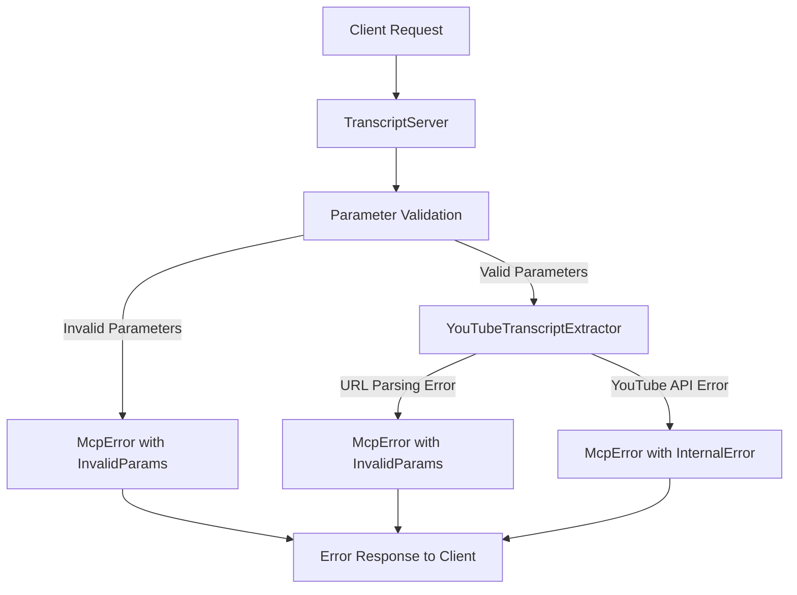

# Chapter 7: Error Handling

## Introduction

Error handling is a critical aspect of any robust application, especially in systems like our YouTube transcript extractor that interact with external services. When dealing with Model Context Protocol (MCP) tools, proper error handling ensures that clients receive meaningful information about what went wrong, helping them to respond appropriately and potentially recover from failures.

In this chapter, we'll explore the error handling strategy implemented in our `mcp-server-youtube-transcript` project, examine the standardized MCP error codes, and see how errors are propagated from internal components to client responses.

## The Importance of Systematic Error Handling

Before diving into implementation details, let's understand why systematic error handling is crucial for our MCP server:

1. **Reliability**: Proper error handling prevents unexpected crashes and ensures the server can continue operating even when individual requests fail
2. **Transparency**: Well-formatted error messages help clients understand what went wrong
3. **Actionability**: Specific error codes and messages enable clients to take appropriate corrective actions
4. **Debugging**: Detailed error information makes it easier to diagnose and fix issues

Our error handling approach addresses all these concerns by implementing a multi-layered strategy that covers various failure scenarios.

## MCP Error Codes

The Model Context Protocol defines a standardized set of error codes that provide a common language for communicating different types of failures. In our application, we use the `ErrorCode` enum from the MCP SDK:

```typescript
// Imported from @modelcontextprotocol/sdk/types.js
enum ErrorCode {
  ParseError = -32700,
  InvalidRequest = -32600,
  MethodNotFound = -32601,
  InvalidParams = -32602,
  InternalError = -32603,
  // ... other error codes
}
```

These standardized codes help clients interpret errors consistently. The most common error codes we use in our application are:

- `ErrorCode.InvalidParams`: When client-provided parameters are missing or invalid
- `ErrorCode.MethodNotFound`: When a client requests an unknown tool
- `ErrorCode.InternalError`: For unexpected internal errors during processing

## The McpError Class

To generate errors that comply with the MCP specification, we use the `McpError` class provided by the SDK:

```typescript
// Example of creating an MCP error
throw new McpError(
  ErrorCode.InvalidParams,
  'URL parameter is required and must be a string'
);
```

Each `McpError` instance includes:

1. An error code from the standardized set
2. A human-readable error message
3. Optional additional data for more complex error scenarios

This structured approach ensures that all errors from our application follow a consistent format that clients can easily parse and understand.

## Error Handling Layers

Our application implements error handling at multiple layers to ensure comprehensive coverage. Let's examine each layer:

### Layer 1: Parameter Validation

The first layer of defense is validating input parameters before processing starts:

```typescript
if (!input || typeof input !== 'string') {
  throw new McpError(
    ErrorCode.InvalidParams,
    'URL parameter is required and must be a string'
  );
}

if (lang && typeof lang !== 'string') {
  throw new McpError(
    ErrorCode.InvalidParams,
    'Language code must be a string'
  );
}
```

This validation:
- Ensures required parameters are present
- Verifies parameter types meet expectations
- Provides clear error messages about what's wrong

By validating early, we catch issues before performing expensive operations and provide immediate feedback to clients.

### Layer 2: Business Logic Error Handling

The next layer handles errors that occur during the execution of business logic. In our application, this happens within the `try/catch` blocks in methods like `extractYoutubeId` and `getTranscript`:

```typescript
extractYoutubeId(input: string): string {
  if (!input) {
    throw new McpError(
      ErrorCode.InvalidParams,
      'YouTube URL or ID is required'
    );
  }

  // Handle URL formats
  try {
    const url = new URL(input);
    // URL parsing logic...
  } catch (error) {
    // Not a URL, check if it's a direct video ID
    if (!/^[a-zA-Z0-9_-]{11}$/.test(input)) {
      throw new McpError(
        ErrorCode.InvalidParams,
        `Invalid YouTube video ID: ${input}`
      );
    }
    return input;
  }

  throw new McpError(
    ErrorCode.InvalidParams,
    `Could not extract video ID from: ${input}`
  );
}
```

In this example, we throw specific `McpError` instances when:
- The input is empty
- A URL can't be parsed and the input doesn't match a valid YouTube ID format
- A valid video ID couldn't be extracted from the input

These errors provide context-specific information about what went wrong during the business logic execution.

### Layer 3: External Service Error Handling

When interacting with external services like the YouTube API, we need to handle potential failures:

```typescript
async getTranscript(videoId: string, lang: string): Promise<string> {
  try {
    const transcript = await getSubtitles({
      videoID: videoId,
      lang: lang,
    });

    return this.formatTranscript(transcript);
  } catch (error) {
    console.error('Failed to fetch transcript:', error);
    throw new McpError(
      ErrorCode.InternalError,
      `Failed to retrieve transcript: ${(error as Error).message}`
    );
  }
}
```

This code:
1. Attempts to fetch subtitles from YouTube
2. Catches any errors that occur during the API call
3. Logs the error for debugging purposes
4. Throws an MCP-compliant error with details about what went wrong

This approach ensures that external service failures are properly captured and communicated to clients.

### Layer 4: Tool Call Error Handling

The `handleToolCall` method includes comprehensive error handling that catches errors from all previous layers:

```typescript
try {
  const videoId = this.extractor.extractYoutubeId(input);
  console.error(`Processing transcript for video: ${videoId}`);
  
  const transcript = await this.extractor.getTranscript(videoId, lang);
  console.error(`Successfully extracted transcript (${transcript.length} chars)`);
  
  // Return success response...
} catch (error) {
  console.error('Transcript extraction failed:', error);
  
  if (error instanceof McpError) {
    throw error;
  }
  
  throw new McpError(
    ErrorCode.InternalError,
    `Failed to process transcript: ${(error as Error).message}`
  );
}
```

This catch block:
1. Logs the error for debugging
2. Passes through `McpError` instances directly, preserving their specific error codes and messages
3. Wraps any other errors in an `McpError` with a generic internal error code

This ensures that regardless of where an error originates, it gets properly formatted before reaching the client.

### Layer 5: Server-Level Error Handling

At the broadest level, we set up error handling for the entire MCP server:

```typescript
private setupErrorHandling(): void {
  this.server.onerror = (error) => {
    console.error("[MCP Error]", error);
  };

  process.on('SIGINT', async () => {
    await this.stop();
    process.exit(0);
  });
}
```

This code:
1. Sets a global error handler for the MCP server to log any errors
2. Sets up process signal handling for graceful shutdown

Additionally, our main function includes error handling for server startup:

```typescript
async function main() {
  const server = new TranscriptServer();
  
  try {
    await server.start();
  } catch (error) {
    console.error("Server failed to start:", error);
    process.exit(1);
  }
}

main().catch((error) => {
  console.error("Fatal server error:", error);
  process.exit(1);
});
```

This ensures that even fatal errors during startup are properly logged before the process exits.

## Error Propagation Flow

Let's examine how errors propagate through our application with a diagram:



This diagram shows how errors at different stages are all eventually transformed into proper MCP errors and sent back to the client.

## Centralized Error Logging

To aid in debugging and monitoring, our application implements centralized error logging at multiple points:

```typescript
// In getTranscript
catch (error) {
  console.error('Failed to fetch transcript:', error);
  // ...
}

// In handleToolCall
catch (error) {
  console.error('Transcript extraction failed:', error);
  // ...
}

// Server-level error handler
this.server.onerror = (error) => {
  console.error("[MCP Error]", error);
};

// Main function error handling
main().catch((error) => {
  console.error("Fatal server error:", error);
  process.exit(1);
});
```

This consistent logging ensures that errors at all levels are recorded, making it easier to diagnose issues during development and production.

## Client-Side Error Handling Example

To complete the picture, let's look at how a client might handle errors from our MCP server:

```javascript
// Client-side code example
async function getVideoTranscript(videoUrl, language = 'en') {
  try {
    const response = await callMcpTool('get_transcript', {
      url: videoUrl,
      lang: language
    });
    
    // Process successful response...
    return response.toolResult.content[0].text;
  } catch (error) {
    // Handle different error types based on error.code
    switch (error.code) {
      case -32602: // InvalidParams
        console.error(`Invalid input parameters: ${error.message}`);
        // Prompt user to correct input
        break;
      case -32603: // InternalError
        console.error(`Server error: ${error.message}`);
        // Retry or notify user of service issues
        break;
      default:
        console.error(`Unknown error: ${error.message}`);
    }
    
    // Rethrow or return a fallback
    throw new Error(`Failed to get transcript: ${error.message}`);
  }
}
```

This client-side code shows how standardized error codes enable clients to handle different types of errors appropriately.

## Common Error Scenarios

Let's explore some common error scenarios in our application and how they're handled:

### 1. Invalid YouTube URL or ID

```typescript
// When a user provides an invalid YouTube URL
try {
  const transcript = await getVideoTranscript('not-a-valid-url');
} catch (error) {
  // Will receive: "Invalid YouTube video ID: not-a-valid-url"
  // With error code: -32602 (InvalidParams)
}
```

### 2. Unavailable Transcript

```typescript
// When a video doesn't have transcripts available
try {
  const transcript = await getVideoTranscript('https://www.youtube.com/watch?v=dQw4w9WgXcQ', 'fr');
} catch (error) {
  // Might receive: "Failed to retrieve transcript: Could not find captions for fr"
  // With error code: -32603 (InternalError)
}
```

### 3. Unknown Tool

```typescript
// When attempting to call a non-existent tool
try {
  const result = await callMcpTool('get_video_details', { url: 'https://www.youtube.com/watch?v=dQw4w9WgXcQ' });
} catch (error) {
  // Will receive: "Unknown tool: get_video_details"
  // With error code: -32601 (MethodNotFound)
}
```

These examples illustrate how different error types provide specific information that helps clients understand and potentially recover from various failure scenarios.

## Best Practices for Error Handling

Our application follows several error handling best practices that are worth highlighting:

### 1. Be Specific

Provide detailed error messages that clearly indicate what went wrong:

```typescript
// Good: Specific error message
throw new McpError(
  ErrorCode.InvalidParams,
  `Invalid YouTube URL: ${input}`
);

// Bad: Vague error message
throw new McpError(
  ErrorCode.InvalidParams,
  "Invalid input"
);
```

### 2. Use Appropriate Error Codes

Match error codes to the actual type of error that occurred:

```typescript
// Good: Correct error code
throw new McpError(
  ErrorCode.InvalidParams,  // For user input issues
  'URL parameter is required'
);

// Bad: Mismatched error code
throw new McpError(
  ErrorCode.InternalError,  // Wrong code for a parameter issue
  'URL parameter is required'
);
```

### 3. Log Errors for Debugging

Always log errors for later analysis:

```typescript
// Good: Log before throwing
console.error('Failed to fetch transcript:', error);
throw new McpError(...);

// Bad: No logging
throw new McpError(...);
```

### 4. Preserve Error Information

When wrapping errors, include information from the original error:

```typescript
// Good: Include original error message
throw new McpError(
  ErrorCode.InternalError,
  `Failed to process transcript: ${(error as Error).message}`
);

// Bad: Lose original error details
throw new McpError(
  ErrorCode.InternalError,
  "An error occurred"
);
```

## Summary

Error handling is a critical aspect of our YouTube transcript extraction service that ensures reliability, transparency, and actionability. Our implementation features:

1. **Standardized error codes** from the MCP specification
2. **Structured error objects** using the `McpError` class
3. **Multi-layered error handling** from parameter validation to server-level errors
4. **Contextual error messages** that provide specific information about failures
5. **Centralized error logging** for debugging and monitoring
6. **Clean error propagation** from internal components to client responses

By implementing these error handling practices, our application provides a robust and user-friendly experience, even when things go wrong. Clients can understand what failed, why it failed, and potentially take corrective action based on the specific error information provided.

Good error handling is not just about preventing crashes—it's about creating a resilient system that gracefully handles unexpected situations and provides meaningful feedback to users. In our YouTube transcript extractor, we've built a comprehensive error handling strategy that fulfills these goals throughout the application.

---

Generated by [AI Codebase Knowledge Builder](https://github.com/The-Pocket/Tutorial-Codebase-Knowledge)