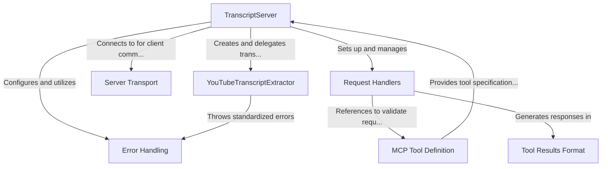

# Tutorial: mcp-server-youtube-transcript

This project implements a **YouTube transcript extractor** service following the **Model Context Protocol (MCP)** specification. The service exposes a tool that allows clients to retrieve and process transcripts from YouTube videos by providing a URL or video ID. The **TranscriptServer** class coordinates the entire process, using **StdioServerTransport** for communication with clients and delegating the actual transcript extraction to the **YouTubeTranscriptExtractor** class. The system includes robust **error handling** and returns transcript results in a standardized format according to the MCP specification, making it easy to integrate with AI models or other applications that follow this protocol.

**Source Repository:** [https://github.com/kimtaeyoon83/mcp-server-youtube-transcript](https://github.com/kimtaeyoon83/mcp-server-youtube-transcript)

## Chapters

1. [MCP Tool Definition
](01_mcp_tool_definition_.md)
2. [TranscriptServer
](02_transcriptserver_.md)
3. [YouTubeTranscriptExtractor
](03_youtubetranscriptextractor_.md)
4. [Tool Results Format
](04_tool_results_format_.md)
5. [Request Handlers
](05_request_handlers_.md)
6. [Server Transport
](06_server_transport_.md)
7. [Error Handling
](07_error_handling_.md)

---

Generated by [AI Codebase Knowledge Builder](https://github.com/The-Pocket/Tutorial-Codebase-Knowledge)